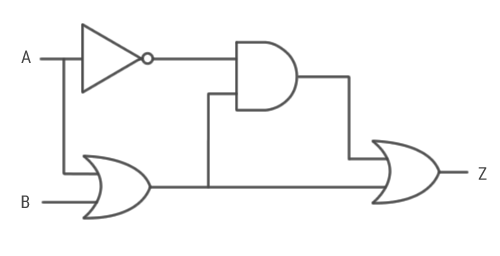

# A TALK ON (MOSTLY) EVERYTHING YOU NEED TO KNOW ABOUT COMPUTING

# IN THE BEGINNING THERE WAS A BIT

## BIT
the world in (0, 1)

## BOOLEAN LOGIC
operations on bits

* AND
* OR
* NOT
* NAND
* NOR

## BYTE
Eight bits make a \underline{byte}

* KiloByte = 1024 bytes
* MegaByte = 1024 KB
* GigaByte = 1024 MB
* TeraByte = 1024 GB

## LOGIC CIRCUITS
You take some bits and some operations and boom you got a \underline{Logic Circuit}.



## CPU - Central Processing Unit
Reprogrammable Logic Gates

{width=50%}


# CODE CODEEE

## MACHINE CODE
* Executed directly by the processor
* Corresponds to Logic Circuit in CPU
* Nobody Does it


Program that does something I got from the Internet
```
[  op  |  rs |  rt |  rd |shamt| funct]
    0     1     2     6     0     32     decimal
 000000 00001 00010 00110 00000 100000   binary
```

## ASSEMBLY LANGUAGE

* Machine Code `10110000 01100001`
* Hexadecimal Code `B0 61`
* Easy to remember names for reading and writing 
```
MOV AL, 61h       ; Load AL with 97 decimal (61 hex)
```

* Assembler is needed to convert Assembly to Machine Code

## LOW-LEVEL LANGUAGE
* Assembly is still hard
* So we code in C and a \underline{Compiler} converts to Assembler

##
{width=90%}

## HIGH-LEVEL LANGUAGE
* Low-Level language is fast, but expressive
* So we have High Level Languages
* Not Compiled but Interpreted
* Python, Ruby, Elixir

## 


# WEB LET'S GET ONLINE
* Desktop Apps are bad and hard to distribute
* So we have Browsers which have their own languages

## WEB LANGUAGES
* HTML, CSS and JAVASCRIPT
* HTML Structure
* CSS Styling
* JAVASCRIPT Interactivity

## NEW THINGS
* HTML5
* CSS3
* ES6, ES7 JS

## FRAMEWORKS
 Don't Repeat Yourself

* The Big Names
* JQUERY
* ANGULAR
* REACT
* VUE

# MOBILE

## ANDROID
* JAVA aane sir evante main
* XML -> Like HTML and CSS
* ANDROID STUDIO - The place where you type the Code

## IOS
* Uses Swift
* Needs MAC

# CROSS PLATFORM

## REACT NATIVE
* REACT on Mobile and Web
* From Facebook

## FLUTTER
* From Google
* Uses Dart

# MACHINE LEARNING
* Give a bunch of Data, the model learns itself
* No need for Explicit Programming

## TENSORFLOW
* The Framework for Machine Learning from Google

# BLOCKCHAIN
* Distributed Ledgers

# IOT
* Small Small Computers everywhere

# LEARNING
* How to learn things
* Use Youtube
* Use Google

# GOOGLE FRIEND
* Check best tutorials to learn Framework

# YOUTUBE
* Follow Tutorials that build projects

# QUANTUM COMPUTING
* QBITS instead of bits
* QBITS are awesome

# ANY QUESTIONS ?

# 4 VARSHAM IND VERUTHE ADAKELE ERINJ KALAYALLE

# THANK YOU ;)
